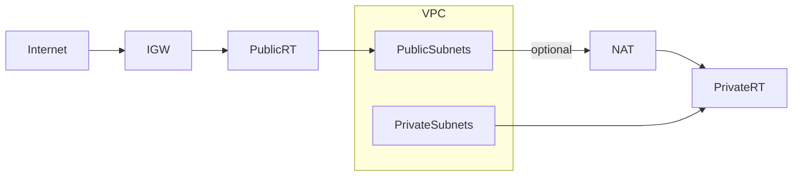

# terraform-vpc-secure

Built to practice production-style AWS networking + Terraform workflows (remote state, modules, debugging, cost awareness).
**Secure AWS VPC infrastructure** in `ap-southeast-1`, built with Terraform.  
Public + private subnets, Internet Gateway, optional NAT Gateway & Flow Logs for observability.

---

## Table of Contents

1. [Overview](#overview)  
2. [Architecture Diagram](#architecture-diagram)  
3. [Setup & Usage](#setup--usage)  
4. [Outputs](#outputs)  
5. [Features](#features)  
6. [Screenshots](#screenshots)
7. [Troubleshooting](#troubleshooting)  
8. [What I Learned](#what-i-learned)

---

## Overview

A Terraform project to provision a VPC with public and private subnets, routing, optional NAT Gateway for egress, and VPC Flow Logs for network observability. Designed using modular Terraform best practices.  

---

## Architecture Diagram



## Setup and Usage

git clone https://github.com/RiceCookerNFT/terraform-vpc-secure.git
cd terraform-vpc-secure

**Initialize Terraform with remote backend**
terraform init -reconfigure -backend-config=envs/dev/backend.hcl

**Format & validate**
terraform fmt -recursive
terraform validate

**Plan and apply**
terraform plan -var-file=envs/dev/terraform.tfvars
terraform apply -auto-approve -var-file=envs/dev/terraform.tfvars

## Features

**VPC with DNS enabled**
Provides internal name resolution (DNS support + hostnames) so resources can communicate reliably inside the VPC.  

**Public subnets with Internet Gateway (IGW)**
EC2 instances launched here can get public IPs and reach the internet. Route table directs `0.0.0.0/0` → IGW.  

**Private subnets with optional NAT Gateway ** 
Instances in private subnets have **no direct inbound access** from the internet. Outbound internet access is possible only when NAT is enabled (useful for package updates, API calls, etc.).  

**VPC Flow Logs to CloudWatch (traffic_type = ALL) ** 
Captures network traffic metadata for security auditing and troubleshooting. Logs stored in CloudWatch Log Groups.  

**Modular Terraform setup with variables & outputs ** 
Reusable Terraform module structure. Parameters like CIDR, AZ count, and project name are defined in `variables.tf`, while subnet IDs, VPC ID, and route table IDs are exported in `outputs.tf`.  

## Screenshots 

VPC Overview
Visual summary of VPC, subnets, route tables, IGW, and NAT.  


NAT Gateway detail
Shows NAT ID, State=Available, Subnet (public), Elastic IP. 


Public Route Table
Shows default route `0.0.0.0/0 → igw-...`. 


Private Route Table
Shows default route `0.0.0.0/0 → nat-...`.  


## Troubleshooting

While building this VPC with Terraform, I ran into a few real-world issues and solved them:

- **Duplicate resource errors**  
  At one point I accidentally defined two private route tables and associations.  
  → Fixed it by ensuring only one `aws_route_table.private` resource exists in the module and reusing it for associations.

- **AWS credential / SignatureDoesNotMatch errors**  
  Terraform/CLI kept failing with `SignatureDoesNotMatch`.  
  → Root cause: leftover environment variables (`AWS_ACCESS_KEY_ID`, `AWS_SECRET_ACCESS_KEY`) overriding my profile.  
  → Solution: cleared env vars with `unset ...`, re-ran `aws configure`, and confirmed with `aws sts get-caller-identity`.

- **Greyed out README diagram**  
  My Mermaid diagram made the whole README grey in preview.  
  → Fixed by properly closing the code block with triple backticks (` ``` `).

- **No NAT Gateway showing in AWS Console**  
  Initially I couldn’t see my NAT Gateway even after `terraform apply`.  
  → Found out I had defined two private route tables by mistake, which broke the association. After cleaning duplicate definitions, NAT Gateway appeared and routes were correct.

- **Terraform version mismatch**  
  Had errors due to running a slightly different Terraform version than the project required.  
  → Solved by upgrading Terraform locally and re-initializing with `terraform init -upgrade`.

## What I Learned

- **Terraform modules & variables**  
  Built a reusable VPC module with parameters for CIDR, AZ count, and project name. Exported outputs for VPC ID, subnets, and route tables.  

- **AWS networking fundamentals**  
  Understood how IGWs, NAT Gateways, route tables, and subnet associations work together to provide public vs private connectivity.  

- **State management**  
  Used remote backend (`backend.hcl` with S3) for Terraform state, ensuring reproducibility and team-ready workflow.  

- **Debugging Terraform & AWS CLI**  
  Solved issues like duplicate resources, misconfigured routes, and `SignatureDoesNotMatch` errors by combining Terraform plan/validate with AWS CLI queries (`describe-nat-gateways`, `describe-route-tables`).  

- **Cost awareness in infrastructure design**  
  Learned to provision NAT Gateways only when needed, verify functionality, and tear them down to avoid unnecessary charges.  

- **Observability integration**  
  Configured VPC Flow Logs to CloudWatch Logs for monitoring network traffic (traffic_type = ALL), validating setup via Console and AWS CLI.


